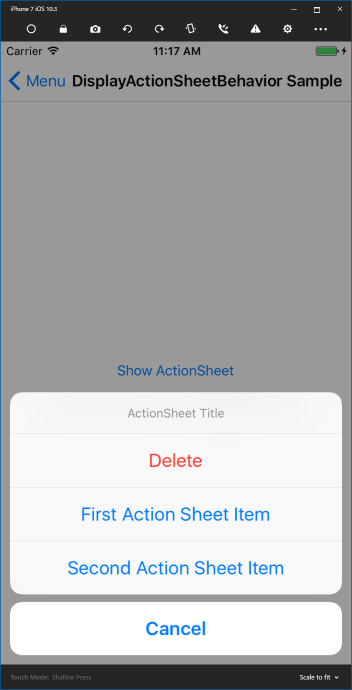

# DisplayActionSheetBehavior

ActionSheetを表示し、ユーザー操作にもとづき定義されたCommandを実行します。   
ActionSheetの表示には、表示のトリガーと表示状態（タイトルやメッセージなど）の定義について、つぎのいずれかを選択できます。  

1. 画面要素のイベントに応じてXAML上に定義された状態で表示する
2. コードからの要求に応じて表示する  
    1. XAML上に定義された状態で表示する  
    2. 表示状態をコードから詳細に指定する  


## 画面要素のイベントに応じてXAML上に定義された状態で表示する  

ユーザーのButtonなどのクリックなどの振る舞いに応じてActionSheetを表示し、ActionSheet上のユーザー操作にもとづきCommandを実行します。  
Buttonのクリック時にActionSheetを表示する例を下に示します。  

```xml
<Button Text="Show ActionSheet">
    <Button.Behaviors>
        <behaviorsPack:DisplayActionSheetBehavior
            EventName="Clicked"
            Title="ActionSheet Title"
            Cancel="Cancel"
            CancelCommand="{Binding CancelCommand}"
            Destruction="Delete"
            DestructionCommand="{Binding DestructionCommand}">
            <behaviorsPack:ActionSheetButton 
                Message="First Action Sheet Item"
                Command="{Binding FirstActionSheetCommand}"/>
            <behaviorsPack:ActionSheetButton 
                Message="Second Action Sheet Item"
                Command="{Binding SecondActionSheetCommand}"/>
        </behaviorsPack:DisplayActionSheetBehavior>
    </Button.Behaviors>
</Button>
```

Buttonをクリックすると次のようなActionSheetが表示されます。  



## コードからの要求に応じて表示する  

（主に）ViewModel側でのコードからの要求に応じてActionSheetを表示することができます。  
このとき表示するAlertの状態（タイトルやメッセージなど）は、XAML上に全て定義する方法と、コード側から全てもしくは一部を指定して表示する方法のいずれかをとれます。

### XAML上に定義された状態で表示する  

コード側にNotificationRequestを定義し、必要時に要求をあげます。  
まずはコード側を見てみましょう。  

```cs
public NotificationRequest DisplayRequest { get; } = new NotificationRequest();

private void Foo()
{
    ...
    DisplayRequest.Raise();
}
```

このようにNotificationRequestをプロパティとして定義し、必要となった際にRaiseイベントを呼び出してActionSheetを表示します。  
XAML側では、先程はEventNameを指定していましたが、こちらはNotificationRequestプロパティへ、前で定義されたDisplayRequestをバインドします。  
こうすることで、DisplayRequest.Raise()の呼び出し時に、XAMLの定義に従ってActionSheetが表示されます。

```xml
<Button Text="Show ActionSheet">
    <Button.Behaviors>
        <behaviorsPack:DisplayActionSheetBehavior
            NotificationRequest="{Binding DisplayRequest}"
            Title="ActionSheet Title"
            Cancel="Cancel"
            CancelCommand="{Binding CancelCommand}"
            Destruction="Delete"
            DestructionCommand="{Binding DestructionCommand}">
            <behaviorsPack:ActionSheetButton 
                Message="First Action Sheet Item"
                Command="{Binding FirstActionSheetCommand}"/>
            <behaviorsPack:ActionSheetButton 
                Message="Second Action Sheet Item"
                Command="{Binding SecondActionSheetCommand}"/>
        </behaviorsPack:DisplayActionSheetBehavior>
    </Button.Behaviors>
</Button>
```

### コード側で表示をコントロールする  

DisplayActionSheetRequestを利用することで、コード側からActionSheetの表示状態を一部、もしくは全てをコントロールすることが可能です。  
実際に例を見てみましょう。  
コード側では次のようにDisplayActionSheetRequestを利用します。  

```cs
public DisplayActionSheetRequest DisplayRequest { get; } = new DisplayActionSheetRequest();

private void Foo()
{
    ...
    var cancel = 
        new ActionSheetButtonAction 
        { 
            Message = "Cancel", 
            Action = () => {
                // Cancelクリック時の処理
                ...
            }
        };
	var destruction = 
        new ActionSheetButtonAction 
        { 
            Message = "Delete", 
            Action = () => {
                // Deleteクリック時の処理
                ...
            }
	var firstActionSheetButton = 
        new ActionSheetButtonAction 
        { 
            Message = "First Action Sheet Item", 
            Action = () => {
                // "First Action Sheet Item"クリック時の処理
                ...
            } 
        };
    var seciondActionSheetButton = 
        new ActionSheetButtonAction 
        { 
            Message = "Second Action Sheet Item", 
            Action = () => {
                // "Second Action Sheet Item"クリック時の処理
                ...
            } 
        };

	request.Raise(
        "Title", cancel, destruction, firstActionSheetButton, seciondActionSheetButton);
}
```

そしてXAMLには、つぎのように記述します。  

```xml
<ContentPage.Behaviors>
    <behaviorsPack:DisplayActionSheetBehavior
        NotificationRequest="{Binding DisplayRequest}"/>
</ContentPage.Behaviors>
```

先ほどのXAMLで定義されたケースと同等のActionSheetが表示されます。  
動的にActionSheetの表示をコントロールしたい場合は、こちらの方法を利用すると良いでしょう。  

なお、XAML上でも各プロパティが指定されていた場合、DisplayActionSheetRequestの値が優先されてます。  
DisplayActionSheetRequest側でnullが指定されていて、XAML上で値が指定されている項目についてはXAML側の定義に従います。  
XAML上で定義されたDisplayActionSheetBehaviorの振る舞いの全て、もしくは一部をDisplayActionSheetRequestで変更することが可能です。  
