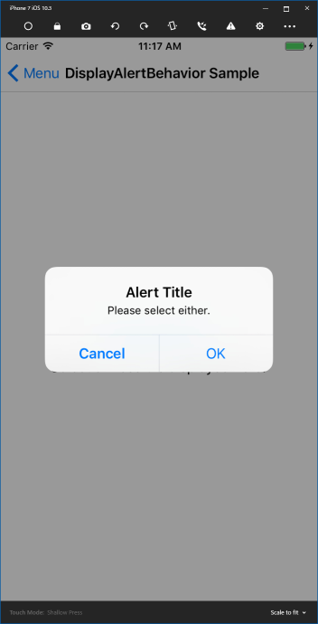

# DisplayAlertBehavior

Display Alert and execute ICommand corresponding to user operation.   
DisplayAlertBehavior can select from several display trigger and visibility.

1. Display in a state defined in XAML, depending on UI Control events
2. Display on request from code  
    1. Display in a state defined in XAML  
    2. Specify display state from code  

## Display in a state defined in XAML, depending on UI Control events  

Displays the Alert, depending on the user's button click etc, and executes the command based on the user operation on the Alert.  
Example to display Alert when the button is clicked.  

```xml
<Button Text="Show Display Alert">
    <Button.Behaviors>
        <behaviorsPack:DisplayAlertBehavior
            EventName="Clicked"
            Title="Alert Title"
            Message="Please select either."
            Accept="OK"
            AcceptCommand="{Binding AcceptCommand}"
            Cancel="Cancel"
            CancelCommand="{Binding CancelCommand}"/>
    </Button.Behaviors>
</Button>
```

Click the button to display the following Alert.  



## Display on request from code  

DisplayAlertBehavior can display Alert on request from code.  
State of Alert to display at this time can be specified in two ways.  
1. Display in a state defined in XAML  
2. Specify display state from code  

### Display in a state defined in XAML  

Define the Notificationrequest in the code and raise it when necessary.    

```cs
public NotificationRequest DisplayRequest { get; } = new NotificationRequest();

private void Foo()
{
    ...
    DisplayRequest.Raise();
}
```

Bind the DisplayRequest property to NotificationRequest properties of DisplayAlertBehavior on XAML.  

```xml
<Button Text="Show Display Alert">
    <Button.Behaviors>
        <behaviorsPack:DisplayAlertBehavior
            NotificationRequest="{Binding DisplayRequest}"
            Title="Alert Title"
            Message="Please select either."
            Accept="OK"
            AcceptCommand="{Binding AcceptCommand}"
            Cancel="Cancel"
            CancelCommand="{Binding CancelCommand}"/>
    </Button.Behaviors>
</Button>
```

### Specify display state from code  

By using DisplayAlertRequest, it is possible to control some or all of the display state of Alert from the code.  

Use the following DisplayAlertRequest in the code.  

```cs
public DisplayAlertRequest DisplayRequest { get; } = new DisplayAlertRequest();

private void Foo()
{
    ...
	request.Raise(
        "Alert Title", 
        "Please select either.", 
        new AlertButton { Message = "OK", Action => () => {
            // Process on OK Click
            ...
        } }, 
        new AlertButton { Message = "Cancel", Action => () => {
            // Process on Cancel Click
            ...
        } });
}
```

XAML is written as:  

```xml
<Button Text="Show Display Alert">
    <Button.Behaviors>
        <behaviorsPack:DisplayAlertBehavior
            NotificationRequest="{Binding DisplayRequest}"/>
    </Button.Behaviors>
</Button>
```

Displays the same Alert as the case defined in the previous XAML.  

If each property was specified in XAML, the value of DisplayAlertreRequest is overridden.  
If NULL is specified on the DisplayAlertreRequest side, it follows the definition of XAML.  
DisplayAlertreRequest can change all or part of the DisplayAlertBehavior defined in XAML.  

## Related References

* [ICommand execution common specification](CommandExecutionSpecifation.md)  
